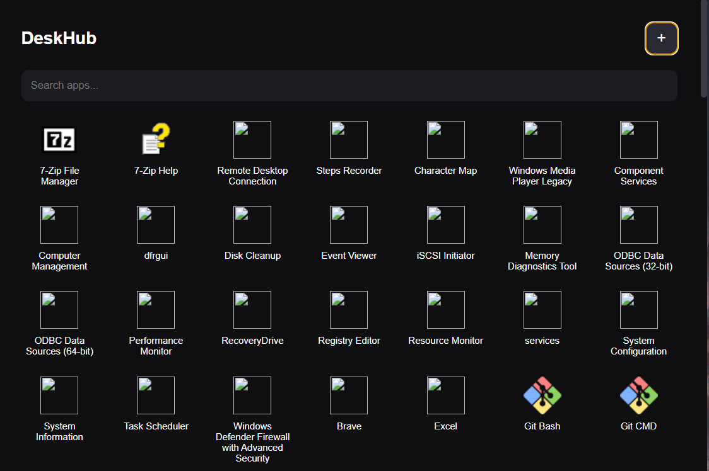

# DeskHub

DeskHub is a minimal desktop app launcher built with Electron.

## Features

- Launch installed applications
- Add websites as apps
- Dock-style interface
- System tray integration

## Tech Stack

- Electron
- HTML
- CSS
- JavaScript

## Project Structure

src/
main/ # Electron main process
preload/ # Secure bridge between UI and system
renderer/ # UI layer

data/
apps.json # Stores installed apps

assets/
icons and images

## Run the project

npm install
npm start

## Preview

## Future Features

- Auto detect installed apps
- Search launcher
- Keyboard shortcuts
- Drag and reorder dock apps
