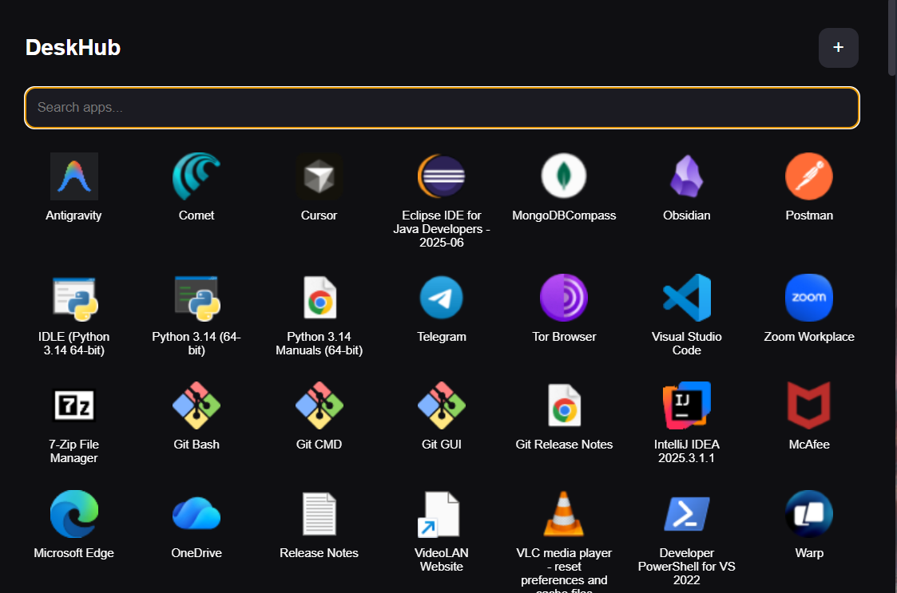
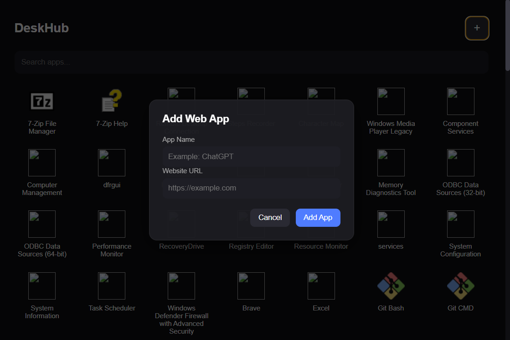

# DeskHub

DeskHub is a minimal keyboard-driven desktop launcher for Windows, built with Electron.

It allows you to quickly launch desktop apps and web apps using a searchable grid interface.

## Features

- Windows app detection
- Start Menu scanning
- Registry app detection
- UWP app support
- Progressive loading
- System tray integration
- Global shortcut (Ctrl + Space)
- Keyboard navigation
- Web app support

## Tech Stack

- Electron
- HTML
- CSS
- JavaScript

## Project Structure

src/
main/ # Electron main process
preload/ # Secure bridge between UI and system
renderer/ # UI layer

data/
apps.json # Empty default user app list for release

assets/
icons and images

Runtime data is stored in Electron's per-user app data directory, including added web apps and generated desktop app icons.

## Run the project

npm install
npm start

## Build the installer

npm run build

## Preview

## Future Features

- Fuzzy search
- Pinned apps
- Plugin system
- Cross platform support
